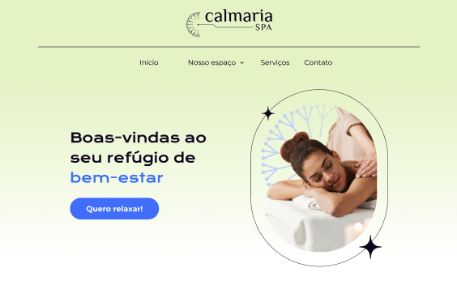

# Calmaria Spa

Uma aplicação para manipulação de elementos interativos como menu com submenus, modais e acordeão com foco em acessibilidade.

## 🔨 Funcionalidades do projeto

O App é uma página onde até o momento todos os elementos são somente visuais. Nela possui um menu de navegação com submenu, modal para se inscrever e ganhar desconto, modal para entrar em contato e um acordeão com as perguntas mais frequentes, todos estes elementos serão interativos utilizando JavaScript.

## ✔️ Técnicas e tecnologias utilizadas

Durante esse curso utilizaremos:

- `Figma`
- `JavaScript`
- `HTLM`
- `CSS`

## 📁 Link do Figma

Você pode [acessar o figma do projeto aqui](https://www.figma.com/file/1pDTUXo7ovT6zlE64Zw509/Calmaria-Spa--%7C-Forma%C3%A7%C3%A3o-Acessibilidade?type=design&node-id=1289%3A1086&mode=dev).

## 🛠️ Abrir e rodar o projeto

Você pode abrir uma página o `index.html`, utilizando o VSCode com a extensão `Live Server` para visualização e atualização automáticas ou abra o arquivo `index.html` diretamente no navegador e atualize manualmente após alterações. Ambos os métodos exibem a página no navegador.
